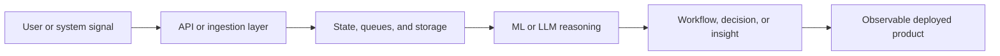

<div align="center">


</div>

```yaml
name: Sreesanth R
role: Software Engineer
location: India
focus:
  - AI systems
  - backend engineering
  - cloud-native workflows
currently_building:
  - retrieval and orchestration systems
  - event-driven applications on AWS
  - full-stack products with strong backend architecture
looking_for:
  - software engineering internships
  - backend engineering roles
  - AI engineering roles
```

<div align="center">

[](https://shreesh-sree.dev)
[](https://linkedin.com/in/sreesanth-sree)
[](mailto:contact@shreesh-sree.dev)
[](https://github.com/Shreesh-Sree)

</div>

## About

I build systems where APIs, data, models, and deployment meet. Most of my projects live at the intersection of backend services, AI-enabled workflows, and cloud infrastructure, with a strong preference for clean interfaces, explicit failure handling, and software that stays understandable as it grows.

## System Profile

```text
input         -> request, event, or user workflow
service layer -> API contracts, auth, validation, orchestration
data layer    -> SQL, vector search, document stores, queues
intelligence  -> retrieval, ranking, reasoning, prediction
output        -> decisions, automations, recommendations, dashboards
```

## Build Map



## Flagship Builds

### [GrievanceFlow](https://github.com/Shreesh-Sree/grievanceflow)
`AWS Lambda` `API Gateway` `SQS` `DynamoDB` `Bedrock` `Terraform`

Event-driven grievance workflow platform built around secure intake, asynchronous processing, and AI-assisted resolution pipelines on AWS.

### [AlgoQX Studio](https://github.com/Shreesh-Sree/algoqx-studio)
`FastAPI` `Streamlit` `FAISS` `SQLAlchemy` `Ollama` `Docker`

AI engineering workspace for retrieval, evaluation, privacy-aware workflows, and local LLM-backed experimentation with deployment-friendly structure.

### [SkillRoute Platform](https://github.com/Shreesh-Sree/skillroute-platform)
`FastAPI` `React` `Firebase` `PostgreSQL` `pgvector` `Groq`

Career-learning platform that combines application services, semantic resource discovery, and personalized workflow design across frontend and backend layers.

### [Agentic PINN for SLS Optimization](https://github.com/Shreesh-Sree/agentic-pinn-sls-optimization)
`PyTorch` `LangGraph` `Ollama` `PostgreSQL` `Docker`

Scientific optimization system combining physics-informed modeling, constrained search, and agentic orchestration for additive manufacturing experimentation.

## Technical Matrix

| Layer | Tools |
| --- | --- |
| Languages | Python, TypeScript, JavaScript, Java, C, C++ |
| Backend | FastAPI, Node.js, REST APIs, auth, async workflows, service design |
| Data | PostgreSQL, pgvector, DynamoDB, Firebase, SQLAlchemy, FAISS |
| AI and ML | LangGraph, Ollama, PyTorch, TensorFlow, scikit-learn, RAG |
| Cloud and DevOps | AWS Lambda, API Gateway, SQS, S3, Terraform, Docker, GitHub Actions, Linux |
| Product | React, Next.js, Streamlit, Vite |

## Coding Profiles

<div align="center">

[](https://leetcode.com/shreesh_sree)
[](https://codeforces.com/profile/Shreesh_exe)
[](https://www.codechef.com/users/shreesh_exe_22)
[](https://www.hackerrank.com/profile/shreesh_exe22)
[](https://auth.geeksforgeeks.org/user/shreeshsree)
[](https://www.naukri.com/code360/profile/shreeshsree)

</div>

## Activity

<div align="center">
  
  
</div>

<div align="center">
  <a href="https://leetcode.com/shreesh_sree">
    
  </a>
  <a href="https://codeforces.com/profile/Shreesh_exe">
    
  </a>
</div>

<div align="center">
  
</div>

## Engineering Notes

```ts
const engineeringPrinciples = [
  "Design data flow before interface polish",
  "Keep failure paths explicit and observable",
  "Use AI where it improves decisions, not just demos",
  "Treat deployment and security as product features"
];
```

<div align="center">

<sub>Open to software engineering, backend, AI engineering, and platform opportunities.</sub>

</div>
