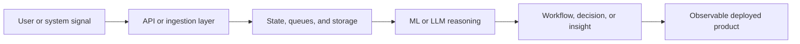

<h1 align="left" id="shreesh-title">:wave: Hello there! I'm Sreesanth R</h1>
<h3 align="left">Software Engineer specializing in Backend Services, AI Systems, and Cloud-Native Workflows</h3>

<p align="left">
  <a href="https://github.com/Shreesh-Sree/Shreesh-Sree"></a>
  <a href="https://www.shreesh-sree.dev"></a>
  <a href="https://github.com/Shreesh-Sree?tab=followers"></a>
  <a href="https://www.linkedin.com/in/sreesanth-sree"></a>
</p>

<a href="#shreesh-title"></a>

- :office: &nbsp;I'm currently seeking **Software Engineering Internships & Backend / AI Engineering roles**
- :seedling: &nbsp;I’m currently building **retrieval/orchestration systems & event-driven apps on AWS**
- :speech_balloon: &nbsp;I like to talk about **System Design, LLM pipelines, and Cloud Infrastructure**
- :book: &nbsp;Learn more about my projects on my **[portfolio](https://www.shreesh-sree.dev)**
- :mailbox: &nbsp;Ask me anything on my **[issues page](https://github.com/Shreesh-Sree/Shreesh-Sree/issues)**
- :computer: &nbsp;Connect with me on **[LinkedIn](https://www.linkedin.com/in/sreesanth-sree)**

<br>

<h2 align="left" id="shreesh-tech">Favorite Tech</h2>

> Tools, languages, and other things that I like to work with.

<table>
  <tr>
    <td align="center" width="96">
      <a href="#shreesh-tech"></a>
      <br>Python
    </td>
    <td align="center" width="96">
      <a href="#shreesh-tech"></a>
      <br>FastAPI
    </td>
    <td align="center" width="96">
      <a href="#shreesh-tech"></a>
      <br>TypeScript
    </td>
    <td align="center" width="96">
      <a href="#shreesh-tech"></a>
      <br>React
    </td>
    <td align="center" width="96">
      <a href="#shreesh-tech"></a>
      <br>AWS
    </td>
    <td align="center" width="96">
      <a href="#shreesh-tech"></a>
      <br>Terraform
    </td>
    <td align="center" width="96">
      <a href="#shreesh-tech"></a>
      <br>Postgres
    </td>
    <td align="center" width="96">
      <a href="#shreesh-tech"></a>
      <br>Docker
    </td>
  </tr>
</table>

<br>

<h2 align="left">About Me</h2>

I build systems where APIs, data, models, and deployment meet. Most of my projects live at the intersection of backend services, AI-enabled workflows, and cloud infrastructure, with a strong preference for clean interfaces, explicit failure handling, and software that stays understandable as it grows.

<br>

<h2 align="left">Architectural Flow</h2>



<br>

<h2 align="left">Featured Projects</h2>

### 🚀 [GrievanceFlow](https://github.com/Shreesh-Sree/grievanceflow)
> Event-driven grievance workflow platform built around secure intake, asynchronous processing, and AI-assisted resolution pipelines on AWS.
> 
> **Tech Stack:** AWS Lambda · API Gateway · SQS · DynamoDB · Bedrock · Terraform

### 🎨 [AlgoQX Studio](https://github.com/Shreesh-Sree/algoqx-studio)
> AI engineering workspace for retrieval, evaluation, privacy-aware workflows, and local LLM-backed experimentation with deployment-friendly structure.
> 
> **Tech Stack:** FastAPI · Streamlit · FAISS · SQLAlchemy · Ollama · Docker

### 🗺️ [SkillRoute Platform](https://github.com/Shreesh-Sree/skillroute-platform)
> Career-learning platform that combines application services, semantic resource discovery, and personalized workflow design across frontend and backend layers.
> 
> **Tech Stack:** FastAPI · React · Firebase · PostgreSQL · pgvector · Groq

### 🔬 [Agentic PINN for SLS Optimization](https://github.com/Shreesh-Sree/agentic-pinn-sls-optimization)
> Scientific optimization system combining physics-informed modeling, constrained search, and agentic orchestration for additive manufacturing experimentation.
> 
> **Tech Stack:** PyTorch · LangGraph · Ollama · PostgreSQL · Docker

<br>

<h2 align="left">Problem Solving & Coding Profiles</h2>

<p align="left">
  <a href="https://leetcode.com/shreesh_sree"></a>
  <a href="https://codeforces.com/profile/Shreesh_exe"></a>
  <a href="https://www.codechef.com/users/shreesh_exe_22"></a>
  <a href="https://www.hackerrank.com/profile/shreesh_exe22"></a>
  <a href="https://auth.geeksforgeeks.org/user/shreeshsree"></a>
  <a href="https://www.naukri.com/code360/profile/shreeshsree"></a>
</p>

<div align="left">
  <a href="https://leetcode.com/shreesh_sree">
    
  </a>
  <a href="https://codeforces.com/profile/Shreesh_exe">
    
  </a>
</div>

<br>

<h2 align="left">Coding Language Distribution</h2>

<a href="#shreesh-title">
  
</a>

<br>

<h2 align="left">Engineering Principles</h2>

```javascript
const engineeringPrinciples = [
  "Design data flow before interface polish",
  "Keep failure paths explicit and observable",
  "Use AI where it improves decisions, not just demos",
  "Treat deployment and security as product features"
];
```
