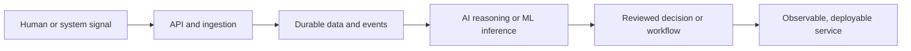

<div align="center">

# Sreesanth R

### Software Engineer building AI systems, backend platforms, and cloud-native workflows.

[LinkedIn](https://linkedin.com/in/sreesanth-sree) · [Portfolio](https://shreesh-sree.dev) · [GitHub](https://github.com/Shreesh-Sree)

</div>

```text
signal -> reliable software -> measurable decisions
```

I am an engineer focused on taking AI-enabled products beyond the demo: secure APIs, event-driven workflows, retrieval systems, data layers, and deployment-ready infrastructure. I care about clear interfaces, operational safety, and systems that remain understandable as they grow.

## Selected Systems

| Project | Engineering focus | Core stack |
| --- | --- | --- |
| [GrievanceFlow](https://github.com/Shreesh-Sree/grievanceflow) | Event-driven case intake, secure workflow orchestration, and AI-assisted resolution | AWS Lambda, API Gateway, SQS, DynamoDB, Bedrock, Terraform |
| [AlgoQX Studio](https://github.com/Shreesh-Sree/algoqx-studio) | AI engineering workbench for RAG, prompt evaluation, privacy, and security workflows | FastAPI, Streamlit, FAISS, SQLAlchemy, Ollama, Docker |
| [SkillRoute](https://github.com/Shreesh-Sree/skillroute-platform) | Career-planning platform with adaptive learning and semantic resource search | FastAPI, React, Firebase, PostgreSQL, pgvector, Groq |
| [Agentic PINN for SLS Optimization](https://github.com/Shreesh-Sree/agentic-pinn-sls-optimization) | Physics-informed prediction and constrained process optimization | PyTorch, LangGraph, Ollama, PostgreSQL, Docker |

## Engineering Map



## Technical Focus

| Area | Tools I use |
| --- | --- |
| AI systems | Python, FastAPI, RAG, FAISS, LangGraph, Ollama, PyTorch |
| Backend and data | REST APIs, async services, PostgreSQL, pgvector, DynamoDB, Firebase |
| Cloud and platform | AWS Lambda, API Gateway, SQS, S3, Terraform, Docker, GitHub Actions |
| Product engineering | TypeScript, React, Streamlit, authentication, observability, secure API design |

## Principles I Build By

- Design the data flow before the interface.
- Make failure paths explicit: retries, idempotency, validation, and useful logs.
- Use AI where it improves a decision; keep deterministic controls around it.
- Treat deployment, security, and observability as product work.

## Current Direction

Building practical AI and platform systems while seeking software engineering opportunities where strong backend fundamentals and applied AI can meet real operational problems.

<div align="center">

<sub>Open to conversations about backend engineering, AI systems, and cloud infrastructure.</sub>

</div>
