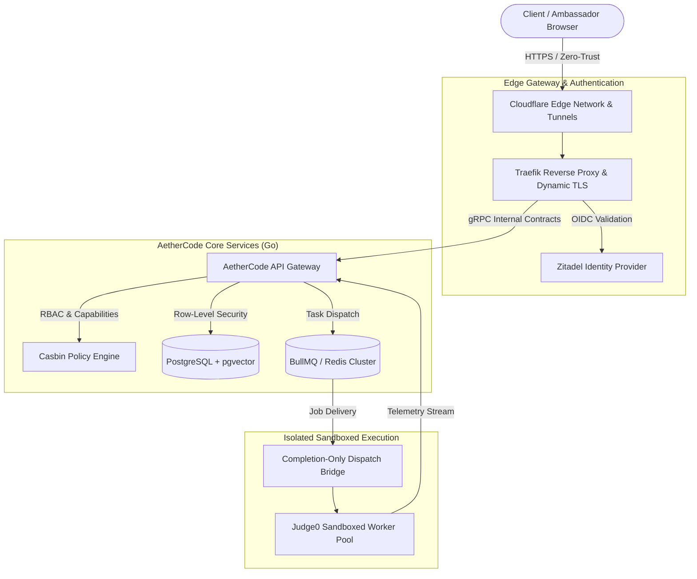

# Sreesanth R

**Systems Architect & Backend Infrastructure Engineer**  
Chennai, India &bull; Technical Lead @ HackerRank Campus Crew &bull; Systems Lead @ AetherCode

[Website](https://shreesh-sree.dev) &nbsp;&bull;&nbsp; [LinkedIn](https://linkedin.com/in/sree-santh) &nbsp;&bull;&nbsp; [GitHub](https://github.com/Shreesh-Sree) &nbsp;&bull;&nbsp; [Email](mailto:shreesh.exe22@gmail.com) &nbsp;&bull;&nbsp; [Codolio](https://codolio.com/profile/shreesh-22)

---

### Overview

Backend and systems engineer specializing in low-level AI inference acceleration, bare-metal cluster orchestration, and zero-trust distributed architectures. Currently pursuing a B.Tech in Artificial Intelligence & Machine Learning at St. Joseph's College of Engineering, Anna University (CGPA 8.40 / 10).

- **Low-Level Inference Engineering:** Author of speculative decoding patches for `llama.cpp` (`FastMTP` draft-vocabulary trimming), achieving 2.5x token throughput acceleration on NVIDIA Blackwell architectures.
- **Bare-Metal Cluster Orchestration:** Architect of multi-tenant compute frameworks using Slurm, NVIDIA MPS, and MIG resource slicing on dual AMD EPYC (256 threads) and dual RTX Pro 6000 Blackwell workstations.
- **Zero-Trust Edge Networks:** Engineered enterprise edge architectures running 15+ isolated microservices with Traefik, Cloudflare Zero-Trust tunnels, and Zitadel OIDC authentication.
- **Selective Engineering Programs:** Former SDE Intern at Presidio (PRIME program, selected 1 of 15 from 2,000+ applicants), AI Research Intern at IIT Jammu, and Databricks Student Fellow APJ 2026 (selected 1 of 38 from 7,171 global applicants).

---

### Bare-Metal Compute & Infrastructure Testbed

All low-level inference experiments, kernel benchmarks, and multi-tenant services run on bare-metal hardware:

| Component | Specification & Architecture |
|:---|:---|
| **Host Processors** | Dual AMD EPYC 9554 &bull; 128 Cores / 256 Threads &bull; 3.75 GHz Max Boost (AVX-512) |
| **GPU Accelerators** | 2&times; NVIDIA RTX Pro 6000 Blackwell &bull; 192 GB GDDR7 Aggregate VRAM &bull; PCIe 5.0 |
| **System Memory** | 512 GB DDR5 ECC Registered &bull; Multi-Channel NUMA Architecture |
| **High-Speed Storage** | Striped PCIe Gen 5 NVMe Solid-State Storage |
| **Orchestration & Slicing** | Slurm Workload Manager &bull; NVIDIA MPS &bull; NVIDIA MIG &bull; Linux NUMA Node Affinity |
| **Local Inference Runtime** | Custom `llama.cpp` (FastMTP) &bull; vLLM Cluster Node &bull; Ollama |

---

### Architecture Topology: AetherCode & Zero-Trust Edge

---

### Upstream Open-Source Contributions & Benchmarks

| Project / Upstream | Focus Area | Technical Impact & Metric | Link |
|:---|:---|:---|:---|
| **`ggml-org/llama.cpp`** | Speculative Decoding | Built `d2t` draft-vocabulary tensor trimming kernels and logit scattering for Qwen-35 architectures. Accelerated throughput from **44.5 tok/s to 113.9 tok/s (+156%)**. | [Branch: `feat/fastmtp-ollama`](https://github.com/Shreesh-Sree/llama.cpp/tree/feat/fastmtp-ollama) |
| **IIT Jammu AI Research** | Physics-Informed Neural Networks | Modeled SLS 3D-printing heat transfer dynamics with energy-density constraints in PyTorch, improving dimensional accuracy by **12%**. | Research Intern |
| **`learnhouse/learnhouse`** | Proctored Exam Platform | Contributed backend extensions in FastAPI/SQLModel to integrate Safe Exam Browser (SEB) for secure, locked-down evaluation sessions. | [learnhouse](https://github.com/learnhouse/learnhouse) |
| **Bare-Metal GPU Slicing** | Slurm / NVIDIA MPS | Built automated Slurm prolog and epilog resource hooks reducing multi-tenant VRAM reclamation latency from **~45s to <500ms**. | [blackwell-gpu-slicing](https://github.com/Shreesh-Sree/blackwell-gpu-slicing) |

---

### Featured Systems

<table>
<tr>
<td width="50%" valign="top">

#### [AetherCode — Distributed Execution Engine](https://github.com/Shreesh-Sree/Aethercode-main)
*High-throughput multi-tenant code assessment & judge platform*
- Architected Go microservices communicating over strict gRPC protobuf definitions.
- Enforced zero cross-tenant data exposure via Casbin capability-based access control, short-lived HMAC tokens, and PostgreSQL row-level security.
- Isolated untrusted code evaluation using Judge0 sandboxed worker clusters behind an async completion bridge.
- **Stack:** `Go`, `gRPC`, `PostgreSQL`, `Casbin`, `Kubernetes`, `Docker`

</td>
<td width="50%" valign="top">

#### [FastMTP — llama.cpp Speculative Acceleration](https://github.com/Shreesh-Sree/llama.cpp/tree/feat/fastmtp-ollama)
*Upstream C++ optimization for qwen35 and qwen35moe models*
- Trimmed the 152k speculative vocabulary tensor to active draft subspace dimensions, slashing tensor compute overhead.
- Engineered logit scattering kernels for low-latency speculative verification.
- Validated on dual RTX Pro 6000 hardware with 2.5x sustained speedup.
- **Stack:** `C++`, `CUDA`, `GGML`, `llama.cpp`

</td>
</tr>
<tr>
<td width="50%" valign="top">

#### [Enterprise Edge & Cloudflare Architecture](https://github.com/Shreesh-Sree/Server-Cloudflare-Architecture)
*Zero-trust ingress gateway for production microservices*
- Production routing across 15+ institutional microservices with zero publicly exposed ports.
- Automated dynamic TLS certificate renewal, Zitadel OIDC enterprise single sign-on, and sub-millisecond local routing.
- Real-time Prometheus metrics scraping and Grafana infrastructure dashboards.
- **Stack:** `Traefik`, `Cloudflare Tunnels`, `Zitadel SSO`, `Prometheus`, `Grafana`

</td>
<td width="50%" valign="top">

#### [Blackwell Dynamic GPU Slicing & Slurm](https://github.com/Shreesh-Sree/blackwell-gpu-slicing)
*Bare-metal multi-tenant GPU allocation framework*
- Custom multi-tenant compute engine with dynamic NVIDIA MPS and MIG resource allocation for dual AMD EPYC (256 threads) + dual RTX Pro 6000 GPUs.
- Automated lifecycle management hooks that immediately release and reallocate idle VRAM upon job completion.
- **Stack:** `Slurm`, `NVIDIA MPS`, `NVIDIA MIG`, `NUMA`, `Linux Kernel`

</td>
</tr>
<tr>
<td width="50%" valign="top">

#### [VeraQX — Real-Time Support Triage Agent](https://github.com/Shreesh-Sree/Aethercode-main)
*Citation-grounded hybrid retrieval engine*
- Fused Okapi BM25 sparse keyword ranking with dense vector embeddings via Reciprocal Rank Fusion (RRF).
- Terminal-based Go application delivering sub-second source-attributed responses for technical campus support queries.
- **Stack:** `Go`, `Hybrid RAG`, `Okapi BM25`, `Reciprocal Rank Fusion`

</td>
<td width="50%" valign="top">

#### [Reimbursement Tool — Enterprise Capstone](https://github.com/Shreesh-Sree/Aethercode-main)
*Tenant-scoped expense platform built during Presidio Internship*
- Multi-tier financial approval workflow with tenant-scoped role-based access control and tamper-proof audit trails.
- Built automated CI/CD deployment to cloud runtimes with Terraform provisioning.
- **Stack:** `FastAPI`, `React`, `PostgreSQL`, `Supabase`, `Terraform`, `Azure`

</td>
</tr>
</table>

---

### Core Technical Arsenal

| Domain | Technologies & Frameworks |
|:---|:---|
| **Core Languages** | Go, C++, Python, TypeScript, SQL, Bash |
| **Backend & Distributed Systems** | gRPC, Protocol Buffers, Gin, FastAPI, Node.js, Express, Fastify, BullMQ, WebSockets, SSE |
| **AI Systems & Acceleration** | CUDA, `llama.cpp`, GGML, vLLM, NVIDIA NIM, PyTorch, LangGraph, RAG Pipelines, MCP |
| **Compute & Orchestration** | Slurm Workload Manager, NVIDIA MPS, NVIDIA MIG, Docker, Podman, Kubernetes, K3s |
| **Databases & Storage** | PostgreSQL (Row-Level Security, pgvector), Redis, SQLite, ClickHouse |
| **Infrastructure & Networking** | Terraform, AWS (ECS, Lambda, CloudWatch), Azure, Cloudflare Zero-Trust, Traefik, Zitadel |
| **Observability & Telemetry** | Prometheus, Grafana, OpenTelemetry, Linux Kernel Tuning (`sysctl`, HugePages, NUMA) |

---

### Experience & Leadership

- **Presidio Inc.** &bull; *Software Development Engineer Intern (PRIME SWE)* &bull; `Jun 2026 – Jul 2026`
  - Selected 1 of 15 from 2,000+ applicants through multi-round technical and system design evaluations.
  - Built JWT/RBAC-secured Node.js microservices with automated CI/CD pipelines targeting AWS ECS and Cloud Run.
  - Implemented LangGraph and Ollama agentic pipelines for secure parsing and structured extraction from unstructured corporate documents.
- **Indian Institute of Technology Jammu** &bull; *Agentic AI Research Intern* &bull; `Jun 2026 – Jul 2026`
  - Implemented physics-informed neural networks (PINNs) in PyTorch to model heat-transfer dynamics and print-parameter accuracy for SLS 3D manufacturing.
- **HackerRank Campus Crew** &bull; *Technical Lead & Campus Ambassador* &bull; `Jun 2026 – Present`
  - Directing technical test-delivery architecture, automated support tooling, and campus ambassador hackathon operations.
- **Databricks** &bull; *Student Fellow APJ 2026* &bull; `2026`
  - Selected 1 of 38 from 7,171 global applicants across the Asia-Pacific & Japan region.
- **AWS Student Builder Group** &bull; *Campus Leader & Core Member* &bull; `Jan 2026 – Present`
  - Leading campus-wide cloud computing workshops, hands-on build challenges, and hackathons.
- **Google Developer Group (GDG) SJCE** &bull; *Technical Coordinator* &bull; `Dec 2025 – Present`
  - Organizing technical sessions on scalable system architectures, AI/ML, and open-source development.

---

### Education

**St. Joseph’s College of Engineering (Anna University)**  
B.Tech, Artificial Intelligence & Machine Learning &bull; **CGPA: 8.40 / 10** &bull; Expected May 2028 &bull; Chennai, Tamil Nadu  
*Core Coursework:* Distributed Systems, Operating Systems, Database Management Systems, Computer Networks, Object-Oriented Design, Data Structures & Algorithms.

---

### Engineering Activity & Telemetry

<picture>
  <source media="(prefers-color-scheme: dark)" srcset="https://raw.githubusercontent.com/Shreesh-Sree/Shreesh-Sree/output/github-contribution-grid-snake-dark.svg" />
  <source media="(prefers-color-scheme: light)" srcset="https://raw.githubusercontent.com/Shreesh-Sree/Shreesh-Sree/output/github-contribution-grid-snake.svg" />
  
</picture>

  

 

<table border="0">
<tr>
<td width="50%" valign="top">

</td>
<td width="50%" valign="top">

</td>
</tr>
</table>

---

Sreesanth R &bull; Chennai, India &bull; <a href="mailto:shreesh.exe22@gmail.com">shreesh.exe22@gmail.com</a> &bull; <a href="https://shreesh-sree.dev">shreesh-sree.dev</a>

