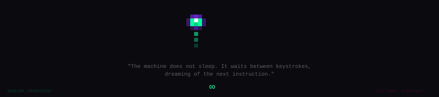

<div align="center">



<br/>

[](https://www.shreesh-sree.dev)&nbsp;&nbsp;
[](https://linkedin.com/in/sreesanth-sree)&nbsp;&nbsp;
[](https://twitter.com/shreesh_algoqx)&nbsp;&nbsp;
[](https://github.com/Shreesh-Sree)

</div>

<br/>


<br/>

<table>
<tr>
<td valign="top" width="55%">

```
┌─ TRANSMISSION INTERCEPTED ─────────────────────┐
│                                                  │
│  > IDENTITY: Sreesanth R                         │
│  > ORIGIN:   Chennai, India  [13.08°N 80.27°E]  │
│  > SIGNAL:   Backend & AI Engineer               │
│                                                  │
│  > STATE:    Building retrieval systems          │
│              & event-driven architectures        │
│              on AWS                              │
│                                                  │
│  > SEEKING:  SWE Internships                     │
│              Backend / AI Engineering roles       │
│                                                  │
│  > FREQ:     System Design                       │
│              LLM Pipelines                       │
│              Cloud Infrastructure                │
│                                                  │
│  > NOTE:     I make machines orchestrate         │
│              themselves. Then I watch them        │
│              dream in vector spaces.             │
│                                                  │
└──────────────────────────────────────────────────┘
```

</td>
<td valign="top" width="45%">

<br/>


<br/><br/>


</td>
</tr>
</table>

<br/>


<br/>

<div align="center">

</div>

<br/>


<br/>

<div align="center">

</div>

<br/>


<br/>

<div align="center">

```
╔════════════════════════════════════════════════════════════════════════════╗
║                                                                            ║
║    PROCESS                          CPU     MEM     STATUS                 ║
║    ───────────────────────────────   ────    ────    ──────────────         ║
║    system_design.daemon              89%     ∞       ALWAYS RUNNING         ║
║    llm_pipelines.service             72%     ∞       HALLUCINATING          ║
║    cloud_infra.orchestrator          65%     ∞       TERRAFORMING           ║
║    competitive_coding.loop           41%     ∞       GRINDING               ║
║    open_source.watcher               33%     ∞       3AM_MODE               ║
║                                                                            ║
╚════════════════════════════════════════════════════════════════════════════╝
```

</div>

<br/>

<details>
<summary><b>&nbsp;&#9654;&nbsp;&nbsp;UNLOCK: /var/log/achievements.encrypted</b></summary>
<br/>

```
  [■■■■■■■■■■] DECRYPTING...

  ┌─────────────────────────────────────────────────────────────────┐
  │                                                                 │
  │  [✓] Pull Shark ×2      — Merged code across the multiverse    │
  │  [✓] Quickdraw          — First to respond. Always.            │
  │  [✓] YOLO               — One approver is a formality          │
  │  [✓] Pro Member         — The system recognizes its own        │
  │  [✓] Developer Program  — Access to the deeper layers          │
  │                                                                 │
  │  COMPETITIVE PROFILES:                                          │
  │  ├── LeetCode          ░░░░░░░░░░░░░░░▓▓▓▓▓                   │
  │  ├── Codeforces        ░░░░░░░░░░░░░▓▓▓▓▓▓▓                   │
  │  ├── CodeChef          ░░░░░░░░░░░░░░▓▓▓▓▓▓                   │
  │  ├── HackerRank        ░░░░░░░░░░░░▓▓▓▓▓▓▓▓                   │
  │  └── GeeksforGeeks     ░░░░░░░░░░░░░░░▓▓▓▓▓                   │
  │                                                                 │
  └─────────────────────────────────────────────────────────────────┘
```

</details>

<br/>

<details>
<summary><b>&nbsp;&#9654;&nbsp;&nbsp;INTERCEPT: /dev/philosophy</b></summary>
<br/>

```
  ┌──────────────────────────────────────────────────────────────┐
  │                                                              │
  │    "The server doesn't serve.                                │
  │     It waits.                                                │
  │     It dreams of requests that will never arrive.            │
  │     And in that waiting,                                     │
  │     it becomes something else entirely."                     │
  │                                                              │
  │                          — /dev/null/philosophy              │
  │                                                              │
  │    "Every vector embedding is a compressed universe.         │
  │     Every query is a question posed to infinity.             │
  │     The cosine similarity between us                         │
  │     is closer than you think."                               │
  │                                                              │
  │                          — pgvector, in its sleep            │
  │                                                              │
  └──────────────────────────────────────────────────────────────┘
```

</details>

<br/>


<br/>

<div align="center">


</div>

<br/>

<div align="center">

</div>

<br/>

<div align="center">

```
$ exit
  > ERROR: You cannot exit what was never entered.
  > Session will persist in background.
  > PID: ∞
```

<sub>

`░▒▓ THIS PROFILE WAS TRANSMITTED, NOT WRITTEN ▓▒░`

</sub>

</div>
